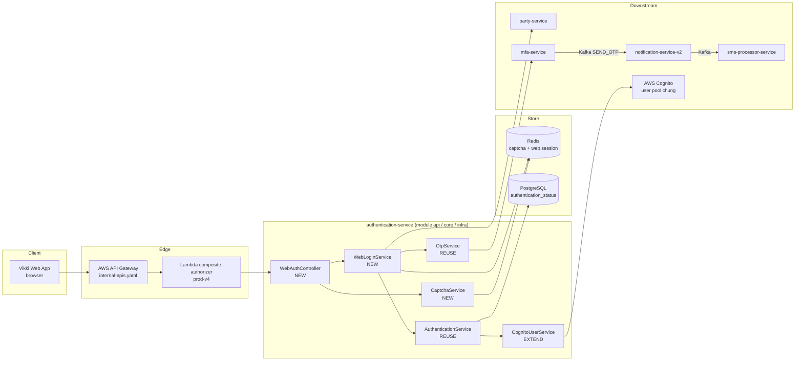
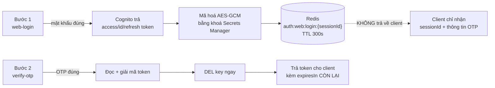
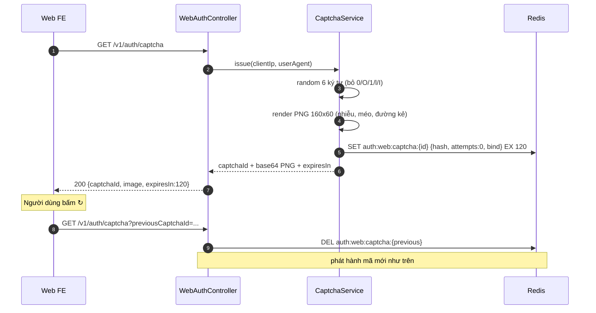
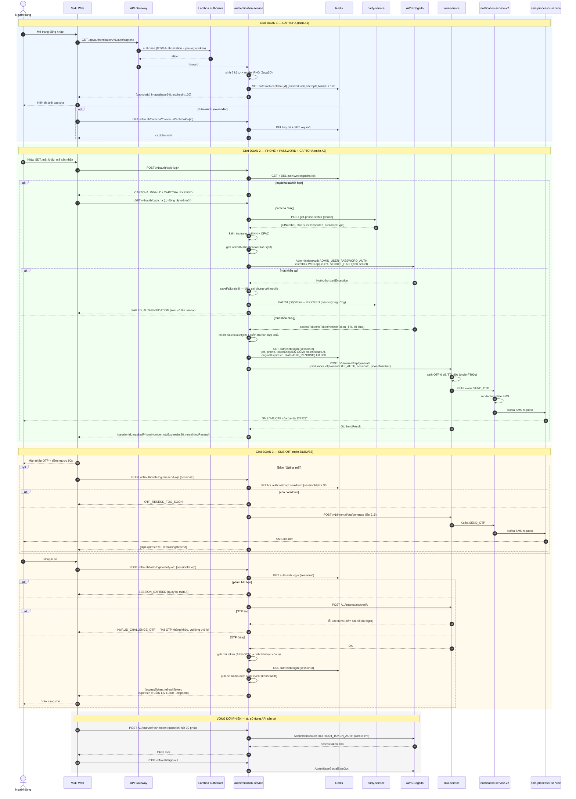
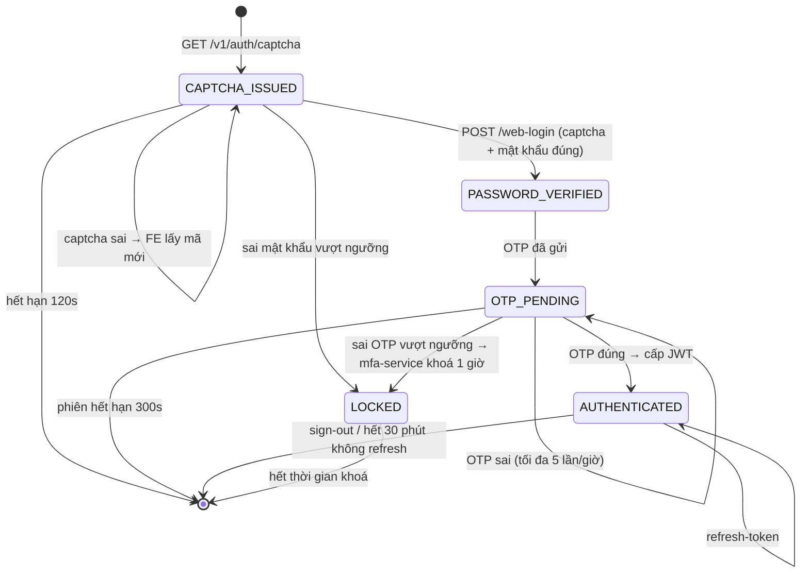

# Thiết kế luồng Đăng nhập Web (`/v1/auth/web-login`) — Tài liệu Thiết kế & Kỹ thuật

| | |
|---|---|
| **Hệ thống** | Vikki Digital Bank — `authentication-service` |
| **Phiên bản tài liệu** | 1.1 |
| **Ngày** | 2026-09-14 |
| **Trạng thái** | Draft — phương án xác thực **đã chốt** (ADR-001); còn 6 điểm `DECISION` chờ review |
| **Nguồn yêu cầu** | `99-code/prompts/002-login-for-web.md`, mockup `99-code/prompts/images/Login.png` |
| **Phạm vi code** | `authentication-service`, `prod-openapi-configs`, `prod-application-workload`, AWS Cognito |
| **Service liên quan** | `party-service`, `config-service`, `mfa-service` (OTP), `notification-service-v2` (template), `sms-processor-service` (gửi SMS) |

**Quy ước màu trong toàn tài liệu:**
- API **tô đen** (chữ thường, đậm): <code><b>API TÁI SỬ DỤNG</b></code> — đã có trên PROD, không sửa.
- API **tô xanh lá**: <code style="color:#0a7a2f;font-weight:bold">API MỚI CẦN THÊM</code>.

**Quy ước độ tin cậy:** `CONFIRMED` = đọc trực tiếp source code ngày 2026-09-13 · `DESIGN` = đề xuất thiết kế mới · `DECISION` = điểm cần chốt · ✅ `DECIDED` = đã chốt, xem [Phụ lục C](#phụ-lục-c--adr-001-phương-án-phát-hành-jwt-cho-luồng-web).

### Lịch sử thay đổi

| Phiên bản | Ngày | Nội dung |
|---|---|---|
| 1.0 | 2026-09-13 | Bản thiết kế đầu tiên |
| 1.1 | 2026-09-14 | **Chốt phương án giữ token Cognito trong Redis.** Bổ sung nguyên tắc hiện thực A1–A7, cách xử lý hao hụt thời hạn token, ADR-001 ở Phụ lục C. Cập nhật mục 4.3, 8 (N4), 12, 14, 15, 16 theo quyết định này. |
| 1.2 | 2026-09-14 | Kiểm chứng lại ghi chú headless/font ở mục 6.3 (nhúng font `.ttf` thay vì dùng font hệ thống). Gỡ phương án Cognito `CUSTOM_AUTH` khỏi tài liệu; mục 4.3.4 chuyển thành "Cơ sở của quyết định". |

## Mục lục

1. [Mục tiêu & phạm vi](#1-mục-tiêu--phạm-vi)
2. [Phân tích màn hình](#2-phân-tích-màn-hình)
3. [Hiện trạng luồng mobile](#3-hiện-trạng-luồng-mobile-trên-prod)
4. [Kiến trúc giải pháp](#4-kiến-trúc-giải-pháp)
5. [AWS Cognito — App client riêng cho web](#5-aws-cognito--app-client-riêng-cho-web)
6. [Tự implement CAPTCHA bằng Redis](#6-tự-implement-captcha-bằng-redis)
7. [Danh sách API](#7-danh-sách-api)
8. [Đặc tả chi tiết API mới](#8-đặc-tả-chi-tiết-api-mới)
9. [Sequence diagram đầy đủ](#9-sequence-diagram-đầy-đủ)
10. [State machine phiên đăng nhập web](#10-state-machine-phiên-đăng-nhập-web)
11. [Mô hình dữ liệu Redis](#11-mô-hình-dữ-liệu-redis)
12. [Bảo mật](#12-bảo-mật)
13. [Cấu hình & hạ tầng](#13-cấu-hình--hạ-tầng)
14. [Kế hoạch triển khai](#14-kế-hoạch-triển-khai)
15. [Kế hoạch kiểm thử](#15-kế-hoạch-kiểm-thử)
16. [Rủi ro, giả định & câu hỏi mở](#16-rủi-ro-giả-định--câu-hỏi-mở)
- [Phụ lục A — Bảng mã lỗi mới](#phụ-lục-a--bảng-mã-lỗi-mới)
- [Phụ lục B — Bảng đối chiếu mobile ↔ web](#phụ-lục-b--bảng-đối-chiếu-mobile--web)
- [Phụ lục C — ADR-001: Phương án phát hành JWT cho luồng web](#phụ-lục-c--adr-001-phương-án-phát-hành-jwt-cho-luồng-web)

---

## 1. Mục tiêu & phạm vi

### 1.1 Mục tiêu

Bổ sung luồng đăng nhập dành riêng cho **Web App** của Vikki, độc lập với luồng mobile đang chạy PROD:

| # | Mục tiêu | Ghi chú |
|---|---|---|
| M1 | API đăng nhập mới `/v1/auth/web-login` | Không đụng vào `/v3/auth/login` của mobile |
| M2 | Xác thực qua Cognito bằng **app client riêng cho web**, dùng **chung user pool** với mobile | User pool: `aws.cognito.user-pool-id` (`AWS_USER_POOL_ID`) |
| M3 | JWT của web hết hạn sau **30 phút** (khác mobile) | Cấu hình ở tầng Cognito app client, không hardcode trong code |
| M4 | CAPTCHA **tự implement**, lưu trạng thái trong **Redis**, hỗ trợ **re-render** | Không dùng Google reCAPTCHA như mobile |
| M5 | Xác thực 2 lớp bằng **SMS OTP 6 số**, hỗ trợ **gửi lại mã** | Qua `mfa-service` → `notification-service-v2` → `sms-processor-service` |
| M6 | Tái sử dụng tối đa hạ tầng hiện có | Party lookup, đếm sai mật khẩu/khoá tài khoản, OTP engine, refresh-token, sign-out |

### 1.2 Trong phạm vi

- Thiết kế API, luồng nghiệp vụ, mô hình dữ liệu Redis, cấu hình Cognito.
- Thay đổi cần thiết trong `authentication-service`.
- Khai báo route API Gateway (`prod-openapi-configs`), biến môi trường/secret (`prod-application-workload`).

### 1.3 Ngoài phạm vi

- Front-end web (React/Next.js) — tài liệu chỉ định nghĩa hợp đồng API.
- Luồng **Quên mật khẩu** trên web (tái sử dụng `/v5/auth/forgot-password`, cần khảo sát riêng vì có bước FACE/NFC).
- Đăng nhập bằng sinh trắc học, VNeID, Smart OTP trên web.
- Migration người dùng — web dùng chung tài khoản (CIF + mật khẩu) với mobile.

---

## 2. Phân tích màn hình

Mockup `prompts/images/Login.png` gồm **5 trạng thái** chia làm 2 nhóm.

### Nhóm A — "Nhập capcha" (2 màn)

| Màn | Nội dung | Yêu cầu kỹ thuật rút ra |
|---|---|---|
| **A1** | Số điện thoại `+84 888 888 888` (có icon lỗi đỏ), ô Password `Vikki99` viền đỏ + dòng `Error messages.`, khối **Nhập mã xác nhận** với placeholder `Type the characters`, ảnh captcha `A3eR7p` và **nút refresh (↻)**. Nút **Đăng nhập** bị disable (xám). Link **Quên mật khẩu?** | • Validate phía client trước khi enable nút<br>• Ảnh captcha là **ảnh**, không phải text → server render<br>• Nút ↻ = **re-render**, lấy captcha mới<br>• Hiển thị lỗi từng field |
| **A2** | Cùng form, đã nhập đủ, password `Vikki999` với icon ẩn/hiện, mã xác nhận `a3er7p` (**chữ thường** trong khi ảnh là `A3eR7p`), nút Đăng nhập active (gradient) | • So khớp captcha **không phân biệt hoa/thường** (`CONFIRMED` từ mockup)<br>• Toggle hiện/ẩn mật khẩu |

### Nhóm B — "Nhập SMS OTP" (3 màn)

| Màn | Nội dung | Yêu cầu kỹ thuật rút ra |
|---|---|---|
| **B1** | `Nhập mã OTP 6 chữ số`, `Đã gửi đến +84908822911.`, `Mã OTP có hiệu lực trong vòng 90 giây.`, 6 ô trống, link **Gửi lại mã**, nút Đăng nhập disable | • OTP **6 chữ số**<br>• Hiển thị **số điện thoại nhận** (theo mockup là **số đầy đủ**)<br>• TTL **90 giây** — trùng khớp cấu hình `OTP_AUTH` của mfa-service (`cycle: PT90s`) `CONFIRMED`<br>• Phải trả TTL về cho FE đếm ngược |
| **B2** | Đã nhập `222222`, nút Đăng nhập active | • Đủ 6 số thì enable nút |
| **B3** | Đã nhập `222222`, lỗi đỏ `Mã OTP không khớp, vui lòng thử lại`, nút Đăng nhập disable, **Gửi lại mã** nổi bật | • Trả lỗi OTP sai rõ ràng<br>• Sau khi sai, cho phép nhập lại / gửi lại<br>• Cần đếm số lần sai để khoá |

### 2.1 Kết luận nghiệp vụ

Luồng web gồm **2 bước gọi server** (không tính lấy captcha):

```
[Lấy captcha]  →  Bước 1: phone + password + captcha  →  Bước 2: OTP  →  Cấp JWT
```

Khác biệt bản chất so với mobile: mobile xác định thiết bị mới rồi chạy **chuỗi challenge động** (OTP → PASSWORD → FACE/NFC); web chỉ có **2 yếu tố cố định** (mật khẩu + SMS OTP) cộng CAPTCHA chống bot.

---

## 3. Hiện trạng luồng mobile trên PROD

Để thấy rõ cái gì tái sử dụng được, tóm tắt luồng mobile (`CONFIRMED`, đọc source 2026-09-13):

| Bước | API | Xử lý chính |
|---|---|---|
| 1 | `POST /v4/auth/verify-phone-number` | `AuthControllerV4` → `UserServiceImpl.verifyPhoneNumber(dto, LOGIN_NEW_DEVICE_WITH_HV_NFC)`: party lookup → 2 rule giới hạn thiết bị → cổng NFC → khởi tạo challenge chain → gửi OTP |
| 2 | `POST /v2\|/v3/auth/challenge` | Trả lời từng challenge trong chain |
| 3 | `POST /v3/auth/login` | `AuthControllerV2.login` → `UserServiceImpl.login`: giải mã base64 mật khẩu → `checkLockedStatusAndVerifyPassword` → Cognito `ADMIN_USER_PASSWORD_AUTH` → trả `accessToken`/`refreshToken` |

**Những chi tiết quan trọng của hạ tầng hiện có (đều `CONFIRMED`):**

1. `AuthController` map **2 prefix** `{"/v1/auth", "/v2/auth"}`; `AuthControllerV2` map `{"/v2/auth", "/v3/auth"}`. ⇒ **Thêm `@PostMapping("/web-login")` vào `AuthController` sẽ vô tình lộ cả `/v2/auth/web-login`.** Bắt buộc tạo controller mới.
2. Xác thực mật khẩu: `AuthenticationServiceImpl.checkLockedStatusAndVerifyPassword(cif, password)` → kiểm tra khoá → `CognitoUserServiceImpl.verifyPasswordByCif` → `AdminInitiateAuthRequest` với `AuthFlowType.ADMIN_USER_PASSWORD_AUTH`, `clientId = aws.cognito.app-client-id`, `SECRET_HASH` tính từ `app-client-secret`.
3. Sai mật khẩu → `authenticationStatusService.saveFailure(cif)` → đủ ngưỡng thì `partyService.blockCustomer(...)` gọi party-service đổi status `BLOCKED`.
4. OTP: `OtpServiceImpl` → `OtpFeignClient` → `${OTP_SERVICE_URL}`. PROD set `OTP_SERVICE_URL = http://mfa-service:8080/api/mfa-service` ⇒ **OTP chạy trên `mfa-service`**, endpoint `POST /v1/internal/otp/generate` và `/v1/internal/otp/verify`, DTO khớp 1-1 với `OtpAttemptDto`.
5. Variant `OTP_AUTH` của mfa-service: `cycle = PT90s`, `discrepancy = 1`, `generation.max = 5/giờ`, `verification.max = 5/giờ`, `lock-duration = PT1H`, `notification-event = SEND_OTP`.
6. Gửi SMS: mfa-service publish Kafka notification event `SEND_OTP` → `notification-service-v2` (`NotificationByChannelService`, template kênh SMS trong bảng metadata) → publish tiếp Kafka → `sms-processor-service` (`SmsProcessorListener`) → SMS gateway (`VIKKI_BANK` / `VIKKI_HDB`).
7. Redis đã sẵn sàng trong service: `redis.host/port/ssl/password/database` + `shared-redis.*`, đã dùng cho challenge session (`redis.duration.session-challenge: 10m`) và login session (`session-login: 5m`).
8. Rate limit: `common-libs:rate-limit`, repository **REDIS**, key generator `WhitelistAwareKeyGenerator` đọc **header `device-id`** — web không có `device-id`, cần key generator mới.
9. reCAPTCHA hiện tại: annotation `@RateLimitedRequestV3` (common-libs `google-serivces-lib`) gọi Google reCAPTCHA Enterprise ở tầng Bean Validation. `Platform` enum chỉ có `ANDROID`/`IOS`/`UNKNOWN` ⇒ **không dùng lại cho web**, đúng như yêu cầu tự implement CAPTCHA.

---

## 4. Kiến trúc giải pháp

### 4.1 Nguyên tắc thiết kế

| # | Nguyên tắc | Lý do |
|---|---|---|
| P1 | **Controller riêng** `WebAuthController` map đúng `/v1/auth` | Tránh rò endpoint sang `/v2` do `@RequestMapping` nhiều path |
| P2 | **Không trả JWT trước khi OTP đúng** | Mật khẩu đúng mới chỉ là yếu tố 1 |
| P3 | **Không lưu mật khẩu** ở bất kỳ đâu (kể cả Redis) | Chuẩn bảo mật ngân hàng |
| P4 | Tái sử dụng `AuthenticationService` cho đếm sai/khoá tài khoản | Web và mobile dùng **chung** chính sách khoá theo CIF |
| P5 | Tái sử dụng `mfa-service` cho OTP, **không tự sinh OTP** | Đã có chống brute-force, đếm resend, lock 1 giờ |
| P6 | JWT expire cấu hình ở **Cognito app client**, không ở code | Đổi thời hạn không cần deploy |
| P7 | Web **không** tham gia rule giới hạn thiết bị của mobile | `device_info` gắn với `deviceId` vật lý; xem [16.2](#162-câu-hỏi-mở) |
| P8 | CAPTCHA là **stateless với client, stateful ở Redis** | Chống replay, hỗ trợ re-render, không phụ thuộc bên thứ ba |

### 4.2 Sơ đồ thành phần



### 4.3 Phương án xác thực — **ĐÃ CHỐT: giữ token Cognito trong Redis**

> ✅ **Quyết định (2026-09-14):** luồng web login **giữ token Cognito (đã mã hoá) trong Redis** giữa hai bước, chỉ trả về client sau khi OTP đúng. Quyết định này **đã chốt**, không còn là điểm mở. Ghi nhận chính thức ở [Phụ lục C — ADR-001](#phụ-lục-c--adr-001-phương-án-phát-hành-jwt-cho-luồng-web).

#### 4.3.1 Vấn đề

Mật khẩu được xác minh ở **bước 1** (`/v1/auth/web-login`), nhưng JWT chỉ được phép cấp ở **bước 2** (sau khi OTP đúng). Trong khi đó Cognito `ADMIN_USER_PASSWORD_AUTH` **trả token ngay** khi mật khẩu đúng — tức là token đã tồn tại trước khi yếu tố thứ hai được xác minh.

#### 4.3.2 Cách giải quyết đã chốt



Nguyên tắc bắt buộc khi hiện thực:

| # | Nguyên tắc | Bắt buộc |
|---|---|---|
| A1 | Token Cognito **không bao giờ** rời server trước khi OTP pass | ✅ |
| A2 | Token trong Redis phải **mã hoá AES-GCM** (không lưu plaintext), khoá lấy từ AWS Secrets Manager (`WEB_LOGIN_TOKEN_ENC_KEY`) | ✅ |
| A3 | TTL phiên web = **300 giây** — đủ cho 90s OTP + 1 lần gửi lại + thời gian người dùng nhập, không hơn | ✅ |
| A4 | `DEL` key **ngay sau khi** đọc thành công ở bước 2 — một phiên đổi được đúng **một** bộ token | ✅ |
| A5 | Trả về client **thời hạn còn lại**, không phải thời hạn gốc — xem [4.3.3](#433-xử-lý-hao-hụt-thời-hạn-token) | ✅ |
| A6 | Nếu bước 2 thất bại vĩnh viễn (hết hạn phiên / khoá OTP) thì `DEL` key để token không nằm lại | ✅ |
| A7 | Không ghi token (kể cả bản mã) ra log, kể cả ở mức `DEBUG` | ✅ |

#### 4.3.3 Xử lý hao hụt thời hạn token

Đây là **nhược điểm cố hữu** của phương án này và phải xử lý tường minh: đồng hồ 30 phút của Cognito bắt đầu chạy từ lúc **phát hành** (bước 1), không phải lúc client nhận (bước 2). Người dùng nhập OTP mất 20–120 giây ⇒ token đến tay client chỉ còn ~28–29,5 phút.

**Cách xử lý:**

```java
// Khi lưu phiên ở bước 1
session.setTokenIssuedAt(Instant.now());
session.setOriginalExpiresIn(loginResult.getExpiresIn());   // 1800 từ Cognito

// Khi trả token ở bước 2
long elapsed   = Duration.between(session.getTokenIssuedAt(), Instant.now()).toSeconds();
long remaining = session.getOriginalExpiresIn() - elapsed;

if (remaining < MIN_USABLE_TOKEN_LIFETIME_SECONDS) {      // đề xuất 600s = 10 phút
    // token còn quá ít thời gian -> huỷ phiên, bắt đăng nhập lại
    redis.delete(sessionKey);
    return Either.left(ErrorCode.SESSION_EXPIRED);
}
response.setExpiresIn(remaining);                          // FE hẹn giờ refresh theo giá trị NÀY
```

| Quy tắc | Giá trị | Lý do |
|---|---|---|
| `expiresIn` trả về client | **thời hạn còn lại**, không phải 1800 | FE hẹn lịch `refresh-token` theo số thật, tránh token chết giữa chừng |
| Ngưỡng tối thiểu còn dùng được | **600 giây (10 phút)** | Với TTL phiên 300s thì trường hợp này gần như không xảy ra; đây là lưới an toàn phòng khi ai đó nâng TTL phiên |
| Hao hụt tối đa theo thiết kế | 300 giây (= TTL phiên) | Người dùng xấu nhất vẫn còn 25 phút |

> ⚠️ **Không** bù hao hụt bằng cách tăng `AccessTokenValidity` của Cognito lên >30 phút — yêu cầu M3 là 30 phút và phải đúng ở tầng Cognito.

#### 4.3.4 Cơ sở của quyết định

1. **Không chạm vào PROD mobile.** Mọi thay đổi nằm trong `authentication-service`; không sửa Lambda authorizer hay Cognito trigger đang phục vụ luồng mobile đang chạy.
2. **Tái sử dụng trọn vẹn `mfa-service`.** Engine OTP hiện có đã bao gồm chống brute-force (5 lần verify/giờ), giới hạn gửi lại (5 lần/giờ), khoá 1 giờ và toàn bộ đường gửi SMS — không phải dựng lại bất kỳ phần nào.
3. **Phạm vi thay đổi gọn.** Toàn bộ nằm trong một service ⇒ dễ test, dễ rollback, dễ bật/tắt bằng feature flag `WEB_LOGIN_ENABLED`.
4. **Redis không phải phụ thuộc mới.** Service đã bắt buộc dùng Redis cho challenge session và rate limit ⇒ không thêm điểm lỗi nào vào đường đăng nhập.

**Điều kiện xem xét lại:** nếu bộ phận Bảo mật không chấp nhận việc giữ token ở Redis dù đã mã hoá, hoặc web cần thêm yếu tố xác thực thứ ba (sinh trắc học, thiết bị tin cậy…), thì mở lại ADR-001 để thiết kế phương án khác.

---

## 5. AWS Cognito — App client riêng cho web

### 5.1 Vì sao phải tạo app client riêng

| Yêu cầu | Giải quyết bằng app client riêng? |
|---|---|
| JWT web hết hạn 30 phút, mobile giữ nguyên | ✅ `AccessTokenValidity` / `IdTokenValidity` là thuộc tính **của app client**, không phải của user pool |
| Dùng chung tài khoản (CIF + mật khẩu) với mobile | ✅ Cùng **user pool** ⇒ cùng kho user, cùng mật khẩu |
| Thu hồi/khoá riêng kênh web khi có sự cố | ✅ Xoá/disable app client web không ảnh hưởng mobile |
| Phân tích/audit theo kênh | ✅ CloudTrail & Cognito logs ghi `clientId` |

> **Quan trọng:** JWT do Cognito phát hành cho cùng user pool sẽ có **cùng `iss`** nhưng khác claim `aud`/`client_id`. Lambda authorizer ở edge phải **chấp nhận thêm** `client_id` của web — xem [13.3](#133-api-gateway--lambda-authorizer).

### 5.2 Phân biệt HAI loại client Cognito trong hệ thống này

Đây là điểm **rất dễ nhầm**, cần nắm trước khi tạo:

| | **(a) User-pool app client** | **(b) M2M client cho pre-login** |
|---|---|---|
| Cấu hình hiện tại | `aws.cognito.app-client-id` / `app-client-secret` (`AWS_CLIENT_ID`, `AWS_CLIENT_SECRET`) | `aws.preLoginAuth.clientSecretMap` + `scope: apigw/mobile-pre-login-user` |
| Dùng để | `AdminInitiateAuth` xác thực **người dùng** bằng mật khẩu | `client_credentials` lấy **pre-login token** cho app gọi API trước khi đăng nhập |
| Endpoint | AWS SDK Cognito IdP | `${PRE_LOGIN_AUTH_URL}/oauth2/token` (hosted domain) |
| PROD | pool `ap-southeast-1_DnBLrQVyE`, client `70gh64i444bqm9p0je8tfj0v7` | client `70gh64i444bqm9p0je8tfj0v7` trong `clientSecretMap` |

⇒ Luồng web cần **cả hai**: một app client web cho mật khẩu (mục 5.3) **và** một M2M client + scope riêng cho pre-login web (mục 5.5).

### 5.3 Tạo user-pool app client cho web

```bash
# region & pool lấy từ prod-application-workload/workload/prod/authentication-service/values.yaml
export AWS_REGION=ap-southeast-1
export USER_POOL_ID=ap-southeast-1_DnBLrQVyE   # AWS_USER_POOL_ID — DÙNG CHUNG với mobile

aws cognito-idp create-user-pool-client \
  --region "$AWS_REGION" \
  --user-pool-id "$USER_POOL_ID" \
  --client-name "vikki-web-app" \
  --generate-secret \
  --explicit-auth-flows ALLOW_ADMIN_USER_PASSWORD_AUTH ALLOW_REFRESH_TOKEN_AUTH \
  --access-token-validity 30 \
  --id-token-validity 30 \
  --refresh-token-validity 1 \
  --token-validity-units AccessToken=minutes,IdToken=minutes,RefreshToken=days \
  --prevent-user-existence-errors ENABLED \
  --enable-token-revocation
```

**Giải thích từng tham số:**

| Tham số | Giá trị | Lý do |
|---|---|---|
| `--user-pool-id` | pool chung với mobile | Yêu cầu M2 — dùng chung kho user |
| `--generate-secret` | bật | Code hiện tại **bắt buộc** có secret: `calculateSecretHash(username)` dùng HMAC-SHA256 với client secret. Không có secret ⇒ `AdminInitiateAuth` lỗi. |
| `--explicit-auth-flows` | `ALLOW_ADMIN_USER_PASSWORD_AUTH`, `ALLOW_REFRESH_TOKEN_AUTH` | Code dùng `AuthFlowType.ADMIN_USER_PASSWORD_AUTH` và `REFRESH_TOKEN_AUTH`. **Không** bật `ALLOW_USER_PASSWORD_AUTH` (flow không qua admin, không cần cho backend) |
| `--access-token-validity 30` + unit `minutes` | 30 phút | **Yêu cầu M3** |
| `--id-token-validity 30` | 30 phút | Đồng bộ với access token |
| `--refresh-token-validity 1 day` | 1 ngày | Web nên ngắn hơn mobile; tối thiểu Cognito cho phép là 1 giờ |
| `--prevent-user-existence-errors ENABLED` | bật | Chống dò tài khoản (user enumeration) |
| `--enable-token-revocation` | bật | Cho phép `AdminUserGlobalSignOut` thu hồi thật sự |

Lệnh trả về `ClientId` và `ClientSecret` — **ghi lại ngay, secret không xem lại được**.

Kiểm tra lại:

```bash
aws cognito-idp describe-user-pool-client \
  --region "$AWS_REGION" --user-pool-id "$USER_POOL_ID" --client-id "<WEB_CLIENT_ID>" \
  --query 'UserPoolClient.{Name:ClientName,Access:AccessTokenValidity,Id:IdTokenValidity,Refresh:RefreshTokenValidity,Units:TokenValidityUnits,Flows:ExplicitAuthFlows}'
```

> **`DECISION`** — Nếu team quản trị hạ tầng bằng Terraform, khai tương đương bằng `aws_cognito_user_pool_client` (`access_token_validity = 30`, `token_validity_units { access_token = "minutes" }`). Không tạo tay trên Console để tránh drift.

### 5.4 Thay đổi code để chọn client theo kênh

`CONFIRMED` — hiện `buildAuthRequest` hardcode `awsConfig.getCognito().getAppClientId()`.

**Bước 1 — mở rộng cấu hình** (`AwsConfig.java`):

```java
@Getter @Setter
public static class Cognito {
    private String userPoolId;
    private String appClientId;        // giữ nguyên — mobile (tương thích ngược)
    private String appClientSecret;
    private String webAppClientId;     // MỚI
    private String webAppClientSecret; // MỚI
}
```

`application.yml`:

```yaml
aws:
  cognito:
    user-pool-id: ${AWS_USER_POOL_ID:ap-southeast-1_jUqlPJ70H}
    app-client-id: ${AWS_CLIENT_ID:...}
    app-client-secret: ${AWS_CLIENT_SECRET:...}
    web-app-client-id: ${AWS_WEB_CLIENT_ID:}          # MỚI
    web-app-client-secret: ${AWS_WEB_CLIENT_SECRET:}  # MỚI
```

**Bước 2 — enum kênh** (`core/model/enums/AuthChannel.java`):

```java
public enum AuthChannel { MOBILE, WEB }
```

**Bước 3 — nạp chồng service** (`CognitoUserService`):

```java
// giữ nguyên chữ ký cũ để không phá mobile
Either<ErrorCode, LoginResult> verifyPasswordByCif(String username, String password);

// mới
Either<ErrorCode, LoginResult> verifyPasswordByCif(String username, String password, AuthChannel channel);
```

`CognitoUserServiceImpl`:

```java
@Override
public Either<ErrorCode, LoginResult> verifyPasswordByCif(String u, String p) {
    return verifyPasswordByCif(u, p, AuthChannel.MOBILE);   // hành vi cũ không đổi
}

@Override
public Either<ErrorCode, LoginResult> verifyPasswordByCif(String u, String p, AuthChannel channel) {
    var client = resolveClient(channel);                    // (clientId, clientSecret)
    Map<String,String> authParams = new HashMap<>();
    authParams.put(USERNAME.name(), u);
    authParams.put(PASSWORD.name(), p);
    authParams.put(SECRET_HASH.name(), calculateSecretHash(u, client.secret()));
    return getAdminInitiateAuthResult(
              buildAuthRequest(AuthFlowType.ADMIN_USER_PASSWORD_AUTH, authParams, client.id()))
           .map(loginResultMapper::map) ...
}
```

⚠️ **`calculateSecretHash` hiện dùng `appClientSecret` cố định** — phải tách tham số secret, nếu không SECRET_HASH sai và Cognito trả `NotAuthorizedException` (biểu hiện giống hệt sai mật khẩu, rất khó debug).

**Bước 4 — refresh token** phải dùng đúng client đã phát hành: lưu `channel` trong session/claim và truyền vào `refreshToken(...)`.

### 5.5 M2M client cho pre-login web

Mobile lấy pre-login token qua `client_credentials` với scope `apigw/mobile-pre-login-user`. Web cần tương đương:

```bash
# 1) Thêm scope mới vào resource server 'apigw'
aws cognito-idp update-resource-server \
  --region "$AWS_REGION" --user-pool-id "$USER_POOL_ID" \
  --identifier apigw --name apigw \
  --scopes ScopeName=mobile-pre-login-user,ScopeDescription="Mobile pre-login" \
           ScopeName=web-pre-login-user,ScopeDescription="Web pre-login"

# 2) Tạo M2M client cho web
aws cognito-idp create-user-pool-client \
  --region "$AWS_REGION" --user-pool-id "$USER_POOL_ID" \
  --client-name "vikki-web-pre-login" --generate-secret \
  --allowed-o-auth-flows client_credentials \
  --allowed-o-auth-scopes "apigw/web-pre-login-user" \
  --allowed-o-auth-flows-user-pool-client
```

Sau đó bổ sung `clientId → secret` vào `aws.preLoginAuth.clientSecretMap` và cho phép `scope` động theo kênh (hiện `scope` là một giá trị đơn `${SCOPE}`).

> **`DECISION`** — Nếu web sẽ gọi API qua **cùng** authorizer `lambda_composite_authorizer_v4` với mobile, có thể **tạm dùng lại** pre-login client của mobile ở Phase 1 và tách ở Phase 2. Cần Security chốt.

---

## 6. Tự implement CAPTCHA bằng Redis

### 6.1 Yêu cầu rút ra từ mockup

| # | Yêu cầu | Nguồn |
|---|---|---|
| C1 | Server render **ảnh** chứa 6 ký tự chữ + số | Màn A1 (`A3eR7p`) |
| C2 | So khớp **không phân biệt hoa/thường** | Màn A2 (ảnh `A3eR7p`, nhập `a3er7p`) |
| C3 | Nút **↻ re-render** — lấy mã mới, mã cũ vô hiệu ngay | Màn A1 |
| C4 | Mã dùng **một lần** | Chuẩn bảo mật |
| C5 | Có thời hạn sống | Chuẩn bảo mật |
| C6 | Lưu trạng thái ở **Redis** | Yêu cầu spec |

### 6.2 Thiết kế tổng thể



### 6.3 Sinh mã & ảnh

```java
// Bảng ký tự bỏ các ký tự dễ nhầm: 0 O o 1 l I
private static final char[] ALPHABET =
    "23456789ABCDEFGHJKLMNPQRSTUVWXYZabcdefghijkmnpqrstuvwxyz".toCharArray();
private static final SecureRandom RANDOM = new SecureRandom();
```

Render bằng **Java2D** (`java.awt`, có sẵn trong JDK, **không cần thư viện ngoài**):

```java
// Nạp một lần khi khởi động — KHÔNG phụ thuộc font hệ thống của container
private static final Font CAPTCHA_FONT;
static {
    try (InputStream in = CaptchaServiceImpl.class.getResourceAsStream("/fonts/DejaVuSans.ttf")) {
        CAPTCHA_FONT = Font.createFont(Font.TRUETYPE_FONT, Objects.requireNonNull(in));
    } catch (Exception e) {
        throw new IllegalStateException("Không nạp được font CAPTCHA", e);
    }
}

BufferedImage img = new BufferedImage(160, 60, BufferedImage.TYPE_INT_RGB);
Graphics2D g = img.createGraphics();
g.setRenderingHint(RenderingHints.KEY_ANTIALIASING, RenderingHints.VALUE_ANTIALIAS_ON);
g.setColor(new Color(0x0F2A4A));                    // nền tối như mockup
g.fillRect(0, 0, 160, 60);
for (int i = 0; i < text.length(); i++) {
    g.setColor(new Color(0x5AC8FA));                // chữ xanh nhạt như mockup
    g.setFont(CAPTCHA_FONT.deriveFont(Font.BOLD, 28f + RANDOM.nextInt(6)));  // font NHÚNG, xem lưu ý bên dưới
    AffineTransform t = AffineTransform.getRotateInstance(
            (RANDOM.nextDouble() - 0.5) * 0.5, 0, 0);  // xoay ±14°
    g.setTransform(t);
    g.drawString(String.valueOf(text.charAt(i)), 12 + i * 23, 40 + RANDOM.nextInt(8));
}
// nhiễu: 4-6 đường cong + 200 chấm ngẫu nhiên
```

> ⚠️ **Lưu ý vận hành — đã kiểm chứng lại (2026-09-14):**
>
> 1. **`-Djava.awt.headless=true` KHÔNG cần thêm và KHÔNG gây tác dụng phụ.** Spring Boot đã tự đặt `java.awt.headless=true` ngay trong `SpringApplication` (`headless = true` mặc định → `configureHeadlessProperty()` gọi `System.setProperty("java.awt.headless", System.getProperty("java.awt.headless", "true"))`) — `CONFIRMED` bằng cách đọc bytecode `spring-boot-3.4.3.jar`. Service **đang chạy headless từ trước tới nay**.
> 2. Headless chỉ chặn các API cần màn hình thật: `Frame`/`Window`/`Dialog`, `Toolkit.getDefaultToolkit().getScreenSize()`, `Robot`, `SystemTray`, `Desktop`, `GraphicsEnvironment.getScreenDevices()`. **`BufferedImage`, `Graphics2D`, `Font`, `AffineTransform`, `ImageIO` đều hoạt động bình thường ở chế độ headless** — đúng những thứ CAPTCHA cần. `CONFIRMED`
> 3. Toàn bộ `authentication-service` và `common-libs` hiện **không dùng bất kỳ API `java.awt`/`javax.imageio`/`javax.swing` nào** ⇒ không có code cũ nào bị ảnh hưởng. `CONFIRMED`
> 4. **Rủi ro thật nằm ở base image, không nằm ở cờ headless.** Jib dùng `bellsoft/liberica-runtime-container:jre-21-slim-glibc` (`api/build.gradle`). Module `java.desktop` **có mặt** trong dòng image này — bằng chứng: `party-service` đang gọi `ImageIO.getReaderFormatNames()` trên PROD với cùng base image (`jre-25-slim-glibc`). Nhưng `ImageIO` **không cần font**, còn `drawString` thì **cần** — nên phải kiểm tra font trước khi hiện thực:
>
> ```bash
> IMG=340396142553.dkr.ecr.ap-southeast-1.amazonaws.com/bellsoft/liberica-runtime-container:jre-21-slim-glibc
> docker run --rm "$IMG" java --list-modules | grep java.desktop     # kỳ vọng: có
> docker run --rm "$IMG" sh -c 'fc-list 2>/dev/null | head; ls /usr/share/fonts 2>/dev/null'
> ```
>
> Nếu **không có font**, `Font("SansSerif", ...)` + `drawString` sẽ ném lỗi hoặc vẽ ra ô vuông. Ba lựa chọn, theo thứ tự ưu tiên:
>
> | Lựa chọn | Cách làm | Đánh đổi |
> |---|---|---|
> | **(a) Nhúng font vào JAR** *(khuyến nghị)* | Đặt 1 file `.ttf` (ví dụ DejaVuSans, ~700 KB) vào `api/src/main/resources/fonts/`, nạp bằng `Font.createFont(Font.TRUETYPE_FONT, stream)` | Không đụng base image, không phụ thuộc fontconfig; tăng ~700 KB |
> | (b) Cài font vào image | Thêm layer cài `fontconfig` + `ttf-dejavu` | Phải đổi/dựng lại base image dùng chung nhiều service |
> | (c) Không dùng font hệ thống | Tự vẽ ký tự bằng `GeneralPath` (glyph vector tự định nghĩa) | Nhiều code, khó chỉnh mỹ thuật |
>
> ⇒ Thiết kế này **chọn (a)**: nhúng font vào resource, không phụ thuộc môi trường container. `DESIGN`

Trả về dạng data URI để FE gắn thẳng vào ``:

```json
{ "captchaId": "c7f1...", "image": "data:image/png;base64,iVBORw0KGgo...", "expiresIn": 120 }
```

### 6.4 Lưu trữ Redis

**Key:** `auth:web:captcha:{captchaId}` — `captchaId` là UUID v4 (không mang thông tin).

**Value** (JSON, serialize bằng `StringRedisTemplate` như các key hiện có):

```json
{
  "answerHash": "sha256(lowercase(answer) + ':' + captchaId + ':' + pepper)",
  "attempts": 0,
  "bindHash": "sha256(clientIp + '|' + userAgent)",
  "issuedAt": "2026-09-13T16:00:00Z"
}
```

| Thuộc tính | Giá trị | Lý do |
|---|---|---|
| TTL | **120 giây** | Đủ để người dùng nhập, đủ ngắn để hạn chế farm giải captcha |
| Không lưu plaintext | `answerHash` = SHA-256 có **pepper** từ Secrets Manager | Ai đọc được Redis cũng không giải được hàng loạt |
| Muối theo `captchaId` | chống rainbow table trên tập 6 ký tự | |
| `attempts` | tối đa **3**, vượt thì `DEL` key | Chống dò mã từ 1 ảnh |
| `bindHash` | ràng buộc IP + User-Agent | Chống chuyển mã đã giải sang máy khác |

**Xác minh (atomic):**

```java
String raw = redis.opsForValue().get(key);          // miss  -> CAPTCHA_EXPIRED
if (raw == null) return Either.left(CAPTCHA_EXPIRED);
// so sánh timing-safe
boolean ok = MessageDigest.isEqual(
        hash(answer.trim().toLowerCase(Locale.ROOT), captchaId).getBytes(UTF_8),
        stored.answerHash().getBytes(UTF_8));
redis.delete(key);                                   // DÙNG MỘT LẦN, đúng hay sai đều xoá
```

> **`DESIGN` — Vì sao xoá key cả khi sai?** Mockup cho phép nhập lại, nhưng nếu giữ key thì kẻ tấn công có 3 lần đoán/ảnh. An toàn hơn: **sai là huỷ mã, FE tự động re-render**. FE phải xử lý mã lỗi `CAPTCHA_INVALID` bằng cách gọi lại `GET /v1/auth/captcha`.

### 6.5 Chống lạm dụng phát hành captcha

Nếu `GET /v1/auth/captcha` không giới hạn, kẻ tấn công có thể bơm hàng triệu key vào Redis.

| Biện pháp | Chi tiết |
|---|---|
| Rate limit theo IP | `auth:web:captcha:rate:{ipHash}` — `INCR` + `EXPIRE 60`, tối đa **20 mã/phút/IP** |
| Giới hạn kích thước | TTL 120s + payload ~200 bytes ⇒ tối đa ~2.400 key/phút/IP, chấp nhận được |
| Không tạo captcha cho IP đang bị block | Kiểm tra key block của rate-limit filter |

---

## 7. Danh sách API

### 7.1 API **tái sử dụng** (không sửa)

| # | API | Service | Vai trò trong luồng web |
|---|---|---|---|
| R1 | <code><b>POST /api/party-service/v2/internal/parties/get-phone-status</b></code> | party-service | Đổi số điện thoại → CIF, lấy `status`, `isOnboarded`, `customerType`, `nonOfacRestricted` |
| R2 | <code><b>AdminInitiateAuth (ADMIN_USER_PASSWORD_AUTH)</b></code> | AWS Cognito | Xác minh mật khẩu, phát hành JWT (dùng **web app client**) |
| R3 | <code><b>POST /api/mfa-service/v1/internal/otp/generate</b></code> | mfa-service | Sinh + gửi OTP `OTP_AUTH` (TTL 90s, tối đa 5 lần/giờ) |
| R4 | <code><b>POST /api/mfa-service/v1/internal/otp/verify</b></code> | mfa-service | Xác minh OTP, đếm sai, khoá 1 giờ |
| R5 | <code><b>Kafka event SEND_OTP</b></code> | mfa-service → notification-service-v2 | Render template SMS |
| R6 | <code><b>Kafka SMS request</b></code> | notification-service-v2 → sms-processor-service | Gửi SMS qua gateway |
| R7 | <code><b>POST /api/party-service/v2/internal/parties/{cif}/status</b></code> | party-service | Khoá tài khoản khi sai mật khẩu quá ngưỡng (qua `blockCustomer`) |
| R8 | <code><b>POST /api/config-service/v1/config/internal/find</b></code> | config-service | Đọc whitelist/feature flag |
| R9 | <code><b>POST /api/authentication/v1/auth/refresh-token</b></code> | authentication-service | Gia hạn phiên web (đã có sẵn ở `AuthController`, map cả `/v1` và `/v2`) |
| R10 | <code><b>POST /api/authentication/v1/auth/sign-out</b></code> | authentication-service | Đăng xuất, thu hồi token |
| R11 | <code><b>POST /api/authentication/v5/auth/forgot-password</b></code> | authentication-service | Link **Quên mật khẩu?** trên mockup (cần khảo sát riêng cho web) |

### 7.2 API **mới cần thêm**

| # | API | Mục đích |
|---|---|---|
| N1 | <code style="color:#0a7a2f;font-weight:bold">GET /api/authentication/v1/auth/captcha</code> | Phát hành ảnh CAPTCHA (kiêm re-render) |
| N2 | <code style="color:#0a7a2f;font-weight:bold">POST /api/authentication/v1/auth/web-login</code> | Bước 1: phone + password + captcha → tạo phiên + gửi OTP |
| N3 | <code style="color:#0a7a2f;font-weight:bold">POST /api/authentication/v1/auth/web-login/resend-otp</code> | Gửi lại mã OTP |
| N4 | <code style="color:#0a7a2f;font-weight:bold">POST /api/authentication/v1/auth/web-login/verify-otp</code> | Bước 2: OTP → cấp JWT |

> **`DESIGN`** — Vì sao tách N4 khỏi N2 thay vì để client gửi cả OTP trong một lần? Vì OTP chỉ tồn tại **sau khi** N2 chạy xong; gộp lại sẽ buộc client giữ mật khẩu trong bộ nhớ suốt 90 giây và gửi lại lần 2 — tăng bề mặt tấn công.

---

## 8. Đặc tả chi tiết API mới

Tất cả bọc trong envelope `ResponseApi` chuẩn của nền tảng:
```json
{ "code": "00", "message": "Success", "payload": { ... } }
```

### N1 — <code style="color:#0a7a2f;font-weight:bold">GET /v1/auth/captcha</code>

| | |
|---|---|
| **Auth** | Pre-login token (`GTW-Authorization`) |
| **Rate limit** | 20 req/phút/IP |
| **Query param** | `previousCaptchaId` *(tuỳ chọn)* — mã cũ cần huỷ khi bấm ↻ |

**Response `200`:**
```json
{
  "code": "00",
  "payload": {
    "captchaId": "8b2f4b7c-...-a91c",
    "image": "data:image/png;base64,iVBORw0KGgoAAAANS...",
    "expiresIn": 120
  }
}
```

**Lỗi:** `TOO_MANY_REQUESTS` (vượt rate limit phát hành).

---

### N2 — <code style="color:#0a7a2f;font-weight:bold">POST /v1/auth/web-login</code>

**Request:**
```json
{
  "countryCode": "+84",
  "phoneNumber": "908822911",
  "password": "Vmlra2k5OTk=",
  "captchaId": "8b2f4b7c-...-a91c",
  "captchaAnswer": "a3er7p"
}
```

| Field | Kiểu | Bắt buộc | Ghi chú |
|---|---|---|---|
| `countryCode` | string | ✅ | Validate bằng `@ValidPhoneNumber` như mobile |
| `phoneNumber` | string | ✅ | |
| `password` | string | ✅ | **Base64** — thống nhất với `/v3/auth/login` hiện tại (`Base64.getDecoder().decode`) |
| `captchaId` | string | ✅ | |
| `captchaAnswer` | string | ✅ | So khớp không phân biệt hoa/thường |

**Response `200`:**
```json
{
  "code": "00",
  "payload": {
    "sessionId": "3f8a...",
    "maskedPhoneNumber": "+84908822911",
    "otpExpiresIn": 90,
    "resendAvailableIn": 30,
    "remainingResend": 4
  }
}
```

**Thứ tự xử lý (fail-fast, thứ tự này là bắt buộc):**

| # | Bước | Sai thì trả |
|---|---|---|
| 1 | Verify CAPTCHA (xoá key ngay) | `CAPTCHA_INVALID` / `CAPTCHA_EXPIRED` |
| 2 | party-service `get-phone-status` | `PHONE_NUMBER_NOT_FOUND` |
| 3 | Kiểm tra trạng thái KH + hạn chế OFAC | `CUSTOMER_RESTRICTED_COUNTER_ONLY`, … |
| 4 | Kiểm tra khoá + verify mật khẩu (Cognito **web client**) | `NOT_ALLOW_LOGIN_IN_LOCKED_TIME`, `FAILED_AUTHENTICATION` (kèm số lần còn lại), `USER_PASSWORD_EXPIRED` |
| 5 | Lưu phiên web vào Redis (token **đã mã hoá**) | `SERVER_ERROR` |
| 6 | mfa-service `otp/generate` | `OTP_GENERATION_LIMIT_EXCEEDED` |

**Payload gửi sang mfa-service ở bước 6** (`OtpAttemptDto` — `CONFIRMED` khớp 1-1 với `OtpRequest` của authentication-service):

```json
{
  "cifNumber": "12345678",
  "otpVariant": "OTP_AUTH",
  "sessionId": "12345678",        // = cifNumber, GIỮ NGUYÊN khuôn của mobile
  "sessionKey": "3f8a...",        // = webSessionId, thay cho deviceId của mobile
  "phoneNumber": "+84908822911",
  "language": "VI",
  "messageFooter": null,
  "actionData": {},
  "data": { "channel": "WEB" }
}
```

⚠️ `sessionId` tham gia vào việc sinh/kiểm OTP của engine `DEFAULT` — đổi giá trị giữa `generate` và `verify` sẽ làm OTP **luôn sai**. Bước N4 phải truyền lại **đúng** cặp `sessionId`/`sessionKey` đã dùng ở N2.

> **Vì sao verify CAPTCHA trước party lookup?** Để một request bot không kích hoạt được bất kỳ lời gọi downstream nào — chặn ở lớp rẻ nhất.

---

### N3 — <code style="color:#0a7a2f;font-weight:bold">POST /v1/auth/web-login/resend-otp</code>

**Request:** `{ "sessionId": "3f8a..." }`

**Response:** `{ "otpExpiresIn": 90, "resendAvailableIn": 30, "remainingResend": 3 }`

- Chống spam 2 lớp: **cooldown 30 giây** giữa 2 lần (key `auth:web:otp:cooldown:{sessionId}`, `SET NX EX 30`) **và** giới hạn cứng 5 lần/giờ do `mfa-service` áp (`OTP_AUTH_MAX_GENERATION_ATTEMPTS`).
- Không gia hạn TTL của phiên web — tránh kéo dài phiên vô hạn bằng cách bấm gửi lại.

**Lỗi:** `SESSION_EXPIRED`, `OTP_RESEND_TOO_SOON`, `OTP_GENERATION_LIMIT_EXCEEDED`.

---

### N4 — <code style="color:#0a7a2f;font-weight:bold">POST /v1/auth/web-login/verify-otp</code>

**Request:** `{ "sessionId": "3f8a...", "otp": "222222" }`

**Response `200`:**
```json
{
  "code": "00",
  "payload": {
    "accessToken": "eyJraWQ...",
    "refreshToken": "eyJjdHki...",
    "expiresIn": 1735,
    "isPinExpired": false,
    "isFirstLogin": false
  }
}
```

⚠️ **`expiresIn` là thời hạn CÒN LẠI, không phải 1800.** Theo ADR-001, token được Cognito phát hành ở bước N2 nên đồng hồ 30 phút đã chạy trong lúc người dùng nhập OTP. Server trả về `originalExpiresIn - elapsed` (ví dụ 1735 = 1800 − 65 giây). FE **phải** hẹn lịch `refresh-token` theo giá trị này, không được giả định 1800. Xem [4.3.3](#433-xử-lý-hao-hụt-thời-hạn-token).

Nếu thời hạn còn lại `< 600` giây, server **không** trả token mà trả `SESSION_EXPIRED` để buộc đăng nhập lại (lưới an toàn A5/A6).

**Xử lý:**
1. Đọc phiên Redis → không có ⇒ `SESSION_EXPIRED` (FE quay lại màn nhập mật khẩu).
2. `mfa-service /otp/verify` → sai ⇒ `INVALID_CHALLENGE_OTP` (mockup B3: *"Mã OTP không khớp, vui lòng thử lại"*), **giữ nguyên phiên** để người dùng nhập lại.
3. Đúng ⇒ giải mã token trong phiên, `DEL` key phiên (**dùng một lần**), publish Kafka auth event, trả token.

**Lỗi:** `SESSION_EXPIRED`, `INVALID_CHALLENGE_OTP`, `OTP_VERIFICATION_LIMIT_EXCEEDED` (mfa-service khoá 1 giờ).

---

## 9. Sequence diagram đầy đủ



### 9.1 Giải thích các quyết định then chốt trong sequence

| Bước | Quyết định | Lý do |
|---|---|---|
| 2 | CAPTCHA lấy **trước** khi người dùng nhập | Mockup A1 hiển thị ngay khi mở form |
| 15 | `GET` + `DEL` captcha trong cùng thao tác | Dùng một lần, chống replay & chống đua (race) |
| 17 | Lookup party **sau** captcha | Bot không chạm được downstream |
| 22 | Dùng **web app client** khi gọi Cognito | Nguồn duy nhất quyết định JWT 30 phút |
| 25 | `saveFailure` dùng chung service với mobile | Chính sách khoá theo CIF thống nhất 2 kênh |
| 31 | Token cất Redis, **không** trả về ngay | Chưa qua yếu tố 2 thì chưa được coi là đăng nhập |
| 32 | TTL phiên **300s** | > 90s OTP + 1 lần resend + thời gian người dùng nhập |
| 33 | Map trường sang mfa-service theo đúng khuôn mobile | `OtpAttemptDto` yêu cầu `cifNumber` + `sessionId` + `sessionKey`. Mobile truyền `sessionId = cifNumber`, `sessionKey = deviceId` (`OtpChallengeHandler.getSessionId/getSessionKey`) — engine `DEFAULT` sinh OTP theo chu kỳ dựa trên các khoá này. Web **giữ nguyên** `sessionId = cifNumber` và dùng `sessionKey = webSessionId` thay cho `deviceId` |
| 55 | OTP sai **không xoá phiên** | Mockup B3 cho phép thử lại |
| 60 | `DEL` phiên sau khi cấp token | Một phiên chỉ đổi được **một** bộ token |

---

## 10. State machine phiên đăng nhập web



---

## 11. Mô hình dữ liệu Redis

| Key | Kiểu | TTL | Nội dung | Ghi chú |
|---|---|---|---|---|
| `auth:web:captcha:{captchaId}` | String (JSON) | 120s | `answerHash`, `attempts`, `bindHash`, `issuedAt` | Xoá khi verify (đúng hoặc sai) hoặc khi re-render |
| `auth:web:captcha:rate:{ipHash}` | String (counter) | 60s | số captcha đã phát hành | `INCR` + `EXPIRE`; ngưỡng 20 |
| `auth:web:login:{sessionId}` | String (JSON) | 300s | `cifNumber`, `phoneNumber`, `tokenEnc` (AES-GCM: access + id + refresh), `tokenIssuedAt`, `originalExpiresIn`, `state`, `createdAt`, `resendCount` | Xoá sau khi cấp token (A4) hoặc khi phiên hỏng vĩnh viễn (A6) |
| `auth:web:otp:cooldown:{sessionId}` | String | 30s | cờ cooldown | `SET NX` |

**Quy ước đặt tên:** dùng tiền tố `auth:web:` để tách rõ khỏi `session:` (login session của mobile, `redis.session-login-prefix`) và khỏi các key rate-limit (`AUTHENTICATION_RATE_LIMIT`). `DESIGN`

**Ước lượng dung lượng:** 10.000 phiên đồng thời × ~2 KB (token Cognito khá dài) ≈ **20 MB** — không đáng kể với cụm Redis hiện tại, nhưng phải theo dõi vì token JWT lớn hơn nhiều so với các key hiện có.

---

## 12. Bảo mật

### 12.1 Bảng kiểm soát rủi ro

| Mối đe doạ | Kiểm soát | Trạng thái |
|---|---|---|
| Dò mật khẩu tự động (credential stuffing) | CAPTCHA + rate limit theo IP + đếm sai theo CIF (dùng chung mobile) + khoá tài khoản qua party-service | `DESIGN` |
| Dò số điện thoại (user enumeration) | Trả **cùng một** mã lỗi cho "số không tồn tại" và "sai mật khẩu"; bật `--prevent-user-existence-errors` ở Cognito | `DECISION` — hiện mobile trả `PHONE_NUMBER_NOT_FOUND` riêng; web nên gộp |
| Replay CAPTCHA | Dùng một lần + TTL 120s + ràng buộc IP/User-Agent | `DESIGN` |
| Farm giải CAPTCHA thuê ngoài | CAPTCHA chỉ là lớp 1; lớp 2 là SMS OTP; theo dõi tỉ lệ giải thành công bất thường | `DESIGN` |
| Đánh cắp token đang "chờ" trong Redis | Mã hoá **AES-GCM** bằng khoá từ Secrets Manager (`WEB_LOGIN_TOKEN_ENC_KEY`); TTL 300s; xoá ngay sau khi dùng (A2/A4); không log dù ở mức DEBUG (A7) | ✅ `DECIDED` — rủi ro cố hữu của ADR-001, đã chấp nhận kèm biện pháp bù |
| Token bị "dùng lại" phiên cũ | `sessionId` dùng một lần, `DEL` ngay sau khi đổi token (A4) | ✅ `DECIDED` |
| Token đến tay client khi gần hết hạn | Trả `expiresIn` **còn lại**; từ chối nếu `< 600s` (A5) | ✅ `DECIDED` — xem [4.3.3](#433-xử-lý-hao-hụt-thời-hạn-token) |
| Bơm SMS (SMS pumping) | Cooldown 30s + tối đa 5 lần/giờ ở mfa-service + rate limit IP ở bước `/web-login` | `DESIGN` |
| Chiếm phiên (session fixation) | `sessionId` = UUID v4 ngẫu nhiên mật mã, dùng một lần, không đoán được | `DESIGN` |
| XSS đánh cắp token | Khuyến nghị FE lưu access token trong **bộ nhớ**, refresh token trong cookie `HttpOnly; Secure; SameSite=Strict` | `DECISION` — cần FE xác nhận |
| Ghi log lộ dữ liệu | Dùng `ObfuscatorUtil.obfuscateCifNumber` như code hiện tại; **không** log mật khẩu, OTP, captcha answer, token | `DESIGN` |

### 12.2 Chữ ký payload ED25519 — khuyến nghị KHÔNG áp dụng cho web

Mobile ký payload bằng ED25519 (`web-filter.signature.url-patterns`). Với web:

- Trình duyệt **không** giữ được private key an toàn — bất kỳ ai mở DevTools đều lấy được.
- Ký ở FE chỉ tạo cảm giác an toàn giả.

⇒ **`DECISION`: không thêm path web vào `url-patterns`.** Bù lại bằng: TLS bắt buộc, CAPTCHA, rate limit, OTP, CORS chặt (chỉ domain web chính thức), CSP.

### 12.3 Chính sách khoá dùng chung giữa web và mobile

`authentication_status` khoá theo `cifNumber`, không theo kênh ⇒ sai mật khẩu trên web **cũng** làm tăng bộ đếm của mobile và ngược lại.

> **`DECISION`** — Giữ nguyên (khuyến nghị): kẻ tấn công không thể "né" giới hạn bằng cách đổi kênh. Nếu nghiệp vụ muốn tách theo kênh thì phải đổi schema `authentication_status` — thay đổi lớn, nên làm ở phase sau.

---

## 13. Cấu hình & hạ tầng

### 13.1 Biến môi trường mới (`authentication-service`)

```yaml
aws:
  cognito:
    web-app-client-id: ${AWS_WEB_CLIENT_ID:}
    web-app-client-secret: ${AWS_WEB_CLIENT_SECRET:}

web-login:
  enabled: ${WEB_LOGIN_ENABLED:false}            # feature flag để bật dần
  session-ttl: ${WEB_LOGIN_SESSION_TTL:PT5M}
  otp-variant: ${WEB_LOGIN_OTP_VARIANT:OTP_AUTH}
  resend-cooldown: ${WEB_LOGIN_OTP_RESEND_COOLDOWN:PT30S}
  token-encryption-key: ${WEB_LOGIN_TOKEN_ENC_KEY:}   # từ Secrets Manager

captcha:
  length: ${CAPTCHA_LENGTH:6}
  ttl: ${CAPTCHA_TTL:PT2M}
  max-attempts: ${CAPTCHA_MAX_ATTEMPTS:3}
  issue-rate-per-ip-per-minute: ${CAPTCHA_ISSUE_RATE:20}
  image:
    width: ${CAPTCHA_IMAGE_WIDTH:160}
    height: ${CAPTCHA_IMAGE_HEIGHT:60}
  pepper: ${CAPTCHA_PEPPER:}                          # từ Secrets Manager
```

### 13.2 Helm (`prod-application-workload/workload/prod/authentication-service/values.yaml`)

Bổ sung vào khối `env` (theo đúng khuôn mẫu đang dùng — `CONFIRMED` dòng 106-121):

```yaml
      - name: AWS_WEB_CLIENT_ID
        value: "<web-client-id>"
      - name: AWS_WEB_CLIENT_SECRET
        valueFrom:
          secretKeyRef:
            name: authentication-service-secret
            key: web_app_client_secret          # key MỚI trong secret hiện có
      - name: WEB_LOGIN_ENABLED
        value: "true"
      - name: WEB_LOGIN_TOKEN_ENC_KEY
        valueFrom:
          secretKeyRef:
            name: authentication-service-secret
            key: web_login_token_enc_key        # key MỚI
      - name: CAPTCHA_PEPPER
        valueFrom:
          secretKeyRef:
            name: authentication-service-secret
            key: captcha_pepper                 # key MỚI
```

> ⚠️ 3 key secret mới phải được tạo trước khi deploy, nếu không pod sẽ `CreateContainerConfigError`.

### 13.3 API Gateway & Lambda authorizer

Thêm 4 route vào `prod-openapi-configs/prod/internal-apis.yaml` (mẫu `CONFIRMED` từ route `/v3/auth/login`):

```yaml
  /api/authentication/v1/auth/captcha:
    get:
      x-api-id: A<NEW-1>
      responses:
        default:
          description: "Issue web login captcha"
      security:
        - lambda_composite_authorizer_v4: []
      x-amazon-apigateway-integration:
        $ref: "#/components/x-amazon-apigateway-integrations/private-aws-loadbalancer"

  /api/authentication/v1/auth/web-login:
    post:
      x-api-id: A<NEW-2>
      responses:
        default:
          description: "Web login step 1 - phone, password, captcha"
      security:
        - lambda_composite_authorizer_v4: []
      x-amazon-apigateway-integration:
        $ref: "#/components/x-amazon-apigateway-integrations/private-aws-loadbalancer"

  /api/authentication/v1/auth/web-login/resend-otp:
    post:
      x-api-id: A<NEW-3>
      # ... như trên
  /api/authentication/v1/auth/web-login/verify-otp:
    post:
      x-api-id: A<NEW-4>
      # ... như trên
```

**Bắt buộc kiểm tra:**
1. `x-api-id` phải **chưa được dùng** trong file (đang có ~460 path).
2. Lambda `composite-authorizer` (stack `prod-v4`) phải **chấp nhận `client_id` của web pre-login client** — nếu không, mọi request web trả 401 dù code đúng.
3. CORS: web gọi từ domain khác ⇒ phải bật CORS cho các route này (mobile không cần nên hiện chưa có).

> Theo rule của knowledge base: **PR sửa `prod-openapi-configs` không bao giờ là low-risk** — file này là body CloudFormation của API Gateway đang chạy PROD.

### 13.4 Rate limit trong service

`application.yml` hiện dùng key generator đọc header `device-id` — web không có. Cần thêm `ClientIpKeyGenerator` (đọc `X-Forwarded-For` đầu tiên):

```yaml
rate-limit:
  key-generators:
    - name: clientIpFromHeader
      generator: com.finx.authentication.api.config.ClientIpKeyGenerator
      params:
        - "X-Forwarded-For"
  policies:
    - duration: ${WEB_LOGIN_RATE_LIMIT_DURATION:5m}
      count: ${WEB_LOGIN_RATE_LIMIT_COUNT:10}
      key-generator: clientIpFromHeader
      routes:
        - uri: ${server.servlet.context-path}/v1/auth/web-login
          method: POST
      block:
        duration: ${WEB_LOGIN_RATE_LIMIT_BLOCK_DURATION:15m}
```

⚠️ Sau ALB/CloudFront, `X-Forwarded-For` có thể chứa nhiều IP — phải lấy IP **client thật** theo cấu hình `trusted proxy`, nếu không toàn bộ traffic sẽ bị gom vào một key và chặn nhầm hàng loạt.

### 13.5 Không cần đổi schema database (Phase 1)

Luồng web **không** ghi `device_info` (xem P7). Truy vết bằng Kafka auth audit event có thêm trường `channel = WEB`.

> **`DECISION`** — Nếu Compliance yêu cầu lưu lịch sử đăng nhập web trong DB, sẽ cần thêm cột `channel` vào `device_info` qua **`prod-liquibase`** (repo riêng, rủi ro cao) và sửa 2 truy vấn đếm thiết bị để loại bản ghi `WEB`. Đưa vào Phase 2.

---

## 14. Kế hoạch triển khai

| Phase | Nội dung | Đầu ra | Phụ thuộc |
|---|---|---|---|
| **0. Chuẩn bị hạ tầng** | Tạo web app client + M2M pre-login client trên Cognito (SIT → UAT → PROD); **sinh khoá AES-256 cho `WEB_LOGIN_TOKEN_ENC_KEY`** (bắt buộc theo ADR-001/A2) và pepper captcha; tạo 3 secret key mới | ClientId/Secret + khoá mã hoá từng môi trường | Team Infra/Security |
| **1. Backend lõi** | `CaptchaService` + `WebAuthController` + `WebLoginService` (hiện thực đúng A1–A7 của ADR-001: mã hoá token, TTL 300s, dùng-một-lần, tính thời hạn còn lại); mở rộng `CognitoUserService` theo kênh; cấu hình mới (mặc định **tắt** bằng `WEB_LOGIN_ENABLED=false`) | PR vào `authentication-service` | Phase 0 |
| **2. Edge** | Thêm 4 route vào `prod-openapi-configs`; cập nhật Lambda authorizer chấp nhận client web; bật CORS | PR `prod-openapi-configs` + `prod-aws-lambda-functions` | Phase 1 |
| **3. Cấu hình & deploy SIT** | Thêm env/secret vào Helm; bật flag ở SIT | PR `prod-application-workload` | Phase 2 |
| **4. Kiểm thử** | Unit + integration + E2E + kiểm thử bảo mật | Báo cáo test | Phase 3 |
| **5. Bật PROD** | Bật flag theo tỉ lệ, theo dõi dashboard | Runbook | Phase 4 |

### 14.1 Danh sách file dự kiến thay đổi

| Repo | File | Loại |
|---|---|---|
| `authentication-service` | `api/.../controller/web/WebAuthController.java` | **Mới** |
| | `api/.../domain/request/{WebLoginRequest,VerifyWebOtpRequest,ResendWebOtpRequest}.java` | **Mới** |
| | `api/.../config/ClientIpKeyGenerator.java` | **Mới** |
| | `core/.../service/{CaptchaService,WebLoginService}.java` | **Mới** |
| | `core/.../model/enums/AuthChannel.java` | **Mới** |
| | `core/.../model/memcache/WebLoginSession.java` | **Mới** |
| | `infra/.../service/impl/{CaptchaServiceImpl,WebLoginServiceImpl}.java` | **Mới** |
| | `infra/.../crypto/WebSessionTokenCipher.java` (AES-GCM, ADR-001/A2) | **Mới** |
| | `api/src/main/resources/fonts/DejaVuSans.ttf` (font nhúng cho CAPTCHA) | **Mới** |
| | `infra/.../service/impl/CognitoUserServiceImpl.java` | Sửa (chọn client theo kênh) |
| | `infra/.../configuration/AwsConfig.java` | Sửa (thêm web client) |
| | `core/.../businessexception/ErrorCode.java` | Sửa (mã lỗi captcha/session) |
| | `api/src/main/resources/application.yml` | Sửa (config + rate limit) |
| `prod-openapi-configs` | `prod/internal-apis.yaml` | Sửa (4 route) |
| `prod-application-workload` | `workload/prod/authentication-service/values.yaml` | Sửa (env + secret) |
| `prod-aws-lambda-functions` | `prod-v4/.../composite-authorizer` | Sửa (chấp nhận client web) |

---

## 15. Kế hoạch kiểm thử

### 15.1 Unit test

| Lớp | Tình huống bắt buộc |
|---|---|
| `CaptchaServiceImpl` | Sinh đúng độ dài; so khớp không phân biệt hoa/thường; hết hạn; dùng lại lần 2 phải fail; re-render xoá mã cũ; vượt rate limit IP |
| `WebLoginServiceImpl` | Captcha sai ⇒ **không** gọi party-service; mật khẩu sai ⇒ tăng bộ đếm; khoá tài khoản ⇒ trả đúng mã lỗi; OTP gửi lỗi ⇒ dọn phiên |
| `CognitoUserServiceImpl` | `MOBILE` dùng client cũ, `WEB` dùng client mới; SECRET_HASH tính theo đúng secret |
| `WebSessionTokenCipher` | Mã hoá → giải mã trả đúng token gốc; đổi khoá ⇒ giải mã fail; bản mã của cùng một token ở 2 lần khác nhau phải **khác nhau** (IV ngẫu nhiên) |
| `WebLoginServiceImpl` (ADR-001) | Token **không** xuất hiện trong response của N2; `expiresIn` ở N4 = `originalExpiresIn - elapsed`; còn `< 600s` ⇒ `SESSION_EXPIRED`; gọi N4 lần 2 với cùng `sessionId` ⇒ `SESSION_EXPIRED` |

### 15.2 Integration test (Testcontainers — đã có sẵn hạ tầng test trong repo)

- Redis thật: TTL captcha, TTL phiên, cooldown resend.
- Mock party-service/Cognito/mfa-service bằng WireMock.
- Kiểm tra `/v2/auth/web-login` **trả 404** (chứng minh không rò endpoint sang prefix khác).
- Đọc thẳng key `auth:web:login:{sessionId}` trong Redis test: giá trị **không được** chứa chuỗi JWT ở dạng đọc được (`eyJ...`) — bằng chứng A2 hoạt động.

### 15.3 E2E trên SIT

| # | Kịch bản | Kỳ vọng |
|---|---|---|
| E1 | Luồng thành công đầy đủ | Nhận JWT; `expiresIn` **nhỏ hơn 1800** đúng bằng thời gian đã trôi; token giải mã được và gọi được API nghiệp vụ |
| E2 | Bấm ↻ 5 lần rồi nhập mã cuối | Thành công; 4 mã trước đều fail |
| E3 | Sai mật khẩu 5 lần | Tài khoản khoá, mobile cũng khoá |
| E4 | Sai OTP 5 lần | mfa-service khoá 1 giờ |
| E5 | Gửi lại mã 2 lần liên tiếp | Lần 2 trả `OTP_RESEND_TOO_SOON` |
| E6 | Chờ 6 phút rồi nhập OTP | `SESSION_EXPIRED` |
| E7 | Dùng lại `sessionId` sau khi đã lấy token | `SESSION_EXPIRED` (A4) |
| E7b | Nhập OTP đúng ở giây thứ ~280 của phiên | Vẫn cấp token; `expiresIn` ≈ 1520 và FE refresh đúng hạn |
| E8 | Đăng nhập web và mobile song song | Hai phiên độc lập, token khác `client_id` |
| E9 | Token web sau 30 phút | Hết hạn; `refresh-token` cấp lại được |

### 15.4 Kiểm thử bảo mật

- Thử bỏ qua captcha (gửi `captchaId` rỗng/bịa) ⇒ phải fail.
- Giải captcha ở IP A, dùng ở IP B ⇒ phải fail (ràng buộc `bindHash`).
- Dò OTP bằng script ⇒ bị khoá sau 5 lần.
- Kiểm tra log không chứa mật khẩu/OTP/token.
- Chạy `/security-review` trên nhánh trước khi merge.

---

## 16. Rủi ro, giả định & câu hỏi mở

### 16.1 Rủi ro

| # | Rủi ro | Mức | Giảm thiểu |
|---|---|---|---|
| R1 | Sửa Lambda authorizer làm gián đoạn **mobile đang chạy PROD** | **Cao** | Chỉ *thêm* client_id được chấp nhận, không đổi logic hiện có; deploy ngoài giờ cao điểm; có kịch bản rollback |
| R2 | `x-api-id` trùng trong `internal-apis.yaml` | Cao | Grep toàn file trước khi đặt; review chéo |
| R3 | Java2D lỗi font trên base image slim (`liberica-runtime-container:jre-21-slim-glibc`) | **Thấp** (sau khi nhúng font) | Nhúng `.ttf` vào resource thay vì dùng font hệ thống (mục 6.3); vẫn giữ integration test sinh ảnh chạy **trong container** để chặn hồi quy. Cờ `-Djava.awt.headless=true` **không** phải nguyên nhân — Spring Boot đã bật sẵn |
| R4 | Token JWT trong Redis làm tăng bộ nhớ đột biến | Trung bình | Giám sát `used_memory`; TTL 300s; cảnh báo khi vượt ngưỡng |
| R4b | Mất/đổi nhầm `WEB_LOGIN_TOKEN_ENC_KEY` ⇒ mọi phiên web đang chờ OTP giải mã thất bại | Trung bình | Coi là sự cố "đăng nhập lại", không mất dữ liệu; xoay khoá **ngoài giờ cao điểm**; log rõ lỗi giải mã tách khỏi lỗi nghiệp vụ |
| R5 | Đếm sai mật khẩu dùng chung khiến người dùng web khoá nhầm tài khoản mobile | Trung bình | Là **chủ đích** (xem 12.3); cần truyền thông cho CSKH |
| R6 | CAPTCHA tự implement yếu hơn reCAPTCHA | Trung bình | Chấp nhận vì OTP là lớp 2; theo dõi tỉ lệ bất thường; có thể nâng cấp sau |
| R7 | `X-Forwarded-For` sai cấu hình ⇒ chặn nhầm toàn bộ người dùng | Trung bình | Test sau ALB ở SIT trước khi bật PROD |

### 16.2 Câu hỏi mở

| # | Câu hỏi | Người quyết |
|---|---|---|
| Q1 | Web có dùng chung pre-login client với mobile ở Phase 1 không? | Security / Architect |
| Q2 | Có gộp `PHONE_NUMBER_NOT_FOUND` vào `FAILED_AUTHENTICATION` để chống dò tài khoản? | Security + UX |
| Q3 | Mockup hiển thị **số điện thoại đầy đủ** (`+84908822911`) — có cần che bớt không? | Compliance |
| Q4 | Lịch sử đăng nhập web có phải lưu DB không (ảnh hưởng `device_info`)? | Compliance |
| Q5 | Refresh token web nên sống bao lâu (đề xuất 1 ngày)? | Product |
| Q6 | Luồng **Quên mật khẩu** trên web đi đường nào (chain hiện tại có FACE/NFC, web không có SDK)? | Product + Architect |
| Q7 | Web có cần giới hạn số phiên đồng thời / thiết bị không? | Product |

### 16.3 Giả định

1. Web app dùng **chung CIF và mật khẩu** với mobile — không có kho tài khoản riêng.
2. Người dùng web đã onboard qua mobile (web **không** có luồng đăng ký).
3. Số điện thoại đã được xác minh ở bước onboarding ⇒ gửi SMS OTP là an toàn.
4. Cụm Redis hiện tại đủ tài nguyên cho phiên web.
5. Domain web chính thức là cố định và biết trước (cấu hình CORS).

---

## Phụ lục A — Bảng mã lỗi mới

| Mã | HTTP | Thông điệp gợi ý cho FE | Bối cảnh |
|---|---|---|---|
| `CAPTCHA_INVALID` | 400 | "Mã xác nhận không đúng" | Sai captcha (FE tự động lấy mã mới) |
| `CAPTCHA_EXPIRED` | 400 | "Mã xác nhận đã hết hạn" | Quá 120s |
| `CAPTCHA_RATE_LIMITED` | 429 | "Vui lòng thử lại sau" | Quá 20 mã/phút/IP |
| `SESSION_EXPIRED` | 400 | "Phiên đăng nhập đã hết hạn, vui lòng đăng nhập lại" | Phiên web quá 300s / đã dùng |
| `OTP_RESEND_TOO_SOON` | 429 | "Vui lòng đợi {n} giây để gửi lại" | Cooldown 30s |
| `OTP_GENERATION_LIMIT_EXCEEDED` | 429 | "Bạn đã yêu cầu quá số lần cho phép" | mfa-service chặn (5/giờ) |
| `OTP_VERIFICATION_LIMIT_EXCEEDED` | 429 | "Nhập sai quá số lần, vui lòng thử lại sau 1 giờ" | mfa-service khoá |

Mã lỗi **tái sử dụng** (đã có trong `ErrorCode.java`): `PHONE_NUMBER_NOT_FOUND`, `FAILED_AUTHENTICATION`, `NOT_ALLOW_LOGIN_IN_LOCKED_TIME`, `USER_PASSWORD_EXPIRED`, `INVALID_CHALLENGE_OTP`, `CUSTOMER_RESTRICTED_COUNTER_ONLY`, `INVALID_INPUT`, `SERVER_ERROR`.

---

## Phụ lục B — Bảng đối chiếu mobile ↔ web

| Khía cạnh | Mobile (PROD) | Web (thiết kế) |
|---|---|---|
| Endpoint đăng nhập | `/v4/auth/verify-phone-number` → `/v3/auth/login` | `/v1/auth/web-login` → `/v1/auth/web-login/verify-otp` |
| Cognito app client | `AWS_CLIENT_ID` | `AWS_WEB_CLIENT_ID` (**mới**) |
| User pool | `AWS_USER_POOL_ID` | **giống hệt** |
| JWT hết hạn | theo app client mobile | **30 phút** |
| Chống bot | Google reCAPTCHA Enterprise (`@RateLimitedRequestV3`) | **CAPTCHA tự implement + Redis** |
| Yếu tố thứ 2 | Chain động: OTP → PASSWORD → FACE/NFC | **SMS OTP (OTP_AUTH, 90s)** |
| Định danh thiết bị | header `device-id` (bắt buộc) | không có ⇒ khoá rate limit theo IP |
| Chữ ký payload | ED25519 bắt buộc | **không áp dụng** |
| Rule giới hạn thiết bị | 2 rule dựa trên `device_info` | không áp dụng (Phase 1) |
| Đếm sai mật khẩu / khoá | `authentication_status` theo CIF | **dùng chung** |
| Engine OTP | mfa-service `OTP_AUTH` | **dùng chung** |
| Thời điểm phát hành JWT | Ngay tại `/v3/auth/login` (bước cuối) | Tại bước 1, **giữ mã hoá trong Redis** rồi mới trả ở bước 2 (ADR-001) |
| `expiresIn` trả về client | Nguyên giá trị Cognito | **Thời hạn còn lại** (1800 − thời gian nhập OTP) |


---

## Phụ lục C — ADR-001: Phương án phát hành JWT cho luồng web

| | |
|---|---|
| **Mã** | ADR-001 |
| **Tiêu đề** | Phát hành JWT sau khi xác minh OTP trong luồng đăng nhập web |
| **Trạng thái** | ✅ **ĐÃ CHẤP NHẬN (Accepted)** — 2026-09-14 |
| **Thay thế** | — |
| **Liên quan** | Mục [4.3](#43-phương-án-xác-thực--đã-chốt-phương-án-1-giữ-token-trong-redis), [8/N4](#n4--post-v1authweb-loginverify-otp), [11](#11-mô-hình-dữ-liệu-redis), [12](#12-bảo-mật) |

### Bối cảnh

Luồng web yêu cầu 2 yếu tố: **mật khẩu** (bước 1) và **SMS OTP** (bước 2). AWS Cognito với `ADMIN_USER_PASSWORD_AUTH` phát hành access/id/refresh token **ngay khi mật khẩu đúng** — tức là trước khi yếu tố thứ hai được xác minh. Cần một cơ chế để token chỉ đến tay người dùng sau khi OTP đúng.

Ràng buộc:

- `mfa-service` đã cung cấp trọn bộ engine OTP (sinh, gửi SMS, đếm sai, khoá 1 giờ, giới hạn gửi lại) và đang phục vụ PROD.
- Các Cognito Lambda trigger `defineauthchallenge` / `createauthchallenge` / `verifyauthchallenge` **đã tồn tại** ở stack `prod/` của `prod-aws-lambda-functions` và đang phục vụ luồng khác.
- Yêu cầu M3: JWT web hết hạn **đúng 30 phút**, cấu hình ở tầng Cognito app client.
- Phải bật/tắt được bằng feature flag và rollback nhanh.

### Quyết định

**Giữ token Cognito trong Redis** giữa hai bước của luồng web login.

Bước 1 xác minh mật khẩu qua Cognito (web app client), **mã hoá AES-GCM** bộ token rồi lưu vào `auth:web:login:{sessionId}` với TTL 300 giây và **không** trả về client. Bước 2, sau khi `mfa-service` xác nhận OTP đúng, server giải mã, `DEL` key và trả token kèm **thời hạn còn lại**.

Các nguyên tắc A1–A7 ở [4.3.2](#432-cách-giải-quyết-đã-chốt) là **bắt buộc**, không phải khuyến nghị.

### Phương án đã cân nhắc

1. **Giữ token trong Redis** *(đã chọn)* — khu trú trong `authentication-service`, tái dùng trọn `mfa-service`.
2. **Yêu cầu mật khẩu lần hai ở bước 2** *(bị loại)* — buộc client giữ mật khẩu trong bộ nhớ suốt 90 giây và truyền đi lần nữa, làm tăng bề mặt tấn công mà không được lợi gì.

### Hệ quả

**Tích cực**

- Không chạm vào hạ tầng edge (Lambda authorizer / Cognito trigger) đang phục vụ mobile PROD ⇒ rủi ro vận hành thấp.
- Tái sử dụng 100% engine OTP của `mfa-service`, gồm cả chống brute-force và giới hạn gửi lại.
- Toàn bộ thay đổi nằm trong một service ⇒ test, bật/tắt và rollback đơn giản.

**Tiêu cực (đã chấp nhận, kèm biện pháp bù)**

| Hệ quả tiêu cực | Biện pháp bù |
|---|---|
| Token JWT tồn tại ở Redis tối đa 300 giây | Mã hoá AES-GCM (A2), TTL ngắn (A3), xoá ngay sau khi dùng (A4), không log (A7) |
| Thời hạn token hao hụt so với 30 phút | Trả `expiresIn` còn lại (A5); từ chối nếu còn `< 600s` |
| Thêm một khoá bí mật phải quản lý (`WEB_LOGIN_TOKEN_ENC_KEY`) | Lưu ở AWS Secrets Manager, nạp qua K8s secret như các khoá hiện có; kịch bản xoay khoá ở rủi ro R4b |
| Redis trở thành thành phần **bắt buộc** của đường đăng nhập web | Redis đã là phụ thuộc bắt buộc sẵn của service (challenge session, rate limit) ⇒ không thêm điểm lỗi mới |

### Điều kiện xem xét lại

Mở lại ADR-001 nếu một trong các điều sau xảy ra:

1. Bộ phận Bảo mật không chấp nhận việc lưu token (dù đã mã hoá) ngoài Cognito.
2. Web cần thêm yếu tố xác thực thứ ba (sinh trắc học, thiết bị tin cậy…) khiến việc điều phối challenge trong service trở nên phức tạp.
3. AWS bổ sung cơ chế phát hành token có điều kiện gọn hơn cho luồng nhiều bước.

---

**Hết tài liệu.** Phương án xác thực đã chốt ở [ADR-001](#phụ-lục-c--adr-001-phương-án-phát-hành-jwt-cho-luồng-web); 6 điểm `DECISION` còn lại (Q1–Q7 trừ phần đã chốt) cần được quyết trong buổi review kiến trúc trước khi bắt đầu Phase 1.
